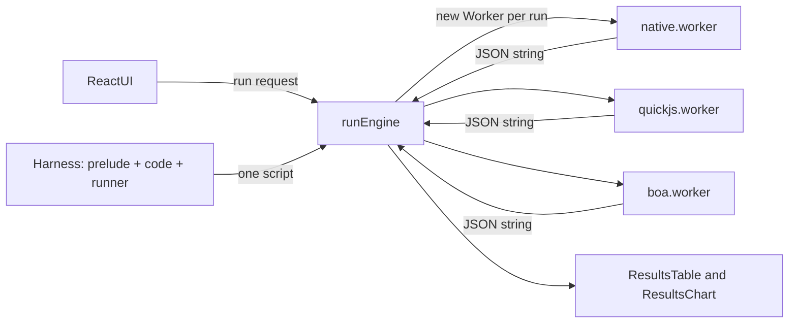

# Browser JS engine bench

A small web app that runs the same JavaScript on three engines and compares them side by side:

| Engine | What it is |
| --- | --- |
| **Native** | Your browser's own engine (V8, SpiderMonkey or JavaScriptCore), with its JIT. |
| **QuickJS** | [QuickJS](https://bellard.org/quickjs/) compiled to WebAssembly, via [quickjs-emscripten](https://github.com/justjake/quickjs-emscripten) (release build, sync variant). |
| **Boa** | [Boa](https://github.com/boa-dev/boa), a JavaScript engine written in Rust, compiled to WebAssembly ([`@boa-dev/boa_wasm`](https://www.npmjs.com/package/@boa-dev/boa_wasm)). |

The interesting question is how much speed you give up when you embed a sandboxed JS interpreter in a page (for plugins, user scripts, untrusted code and so on) instead of running code on the browser's engine directly.

You can run the classic [V8 benchmark suite (v7)](https://github.com/mozilla/arewefastyet/tree/master/benchmarks/v8-v7) or paste your own code.

## Getting started

Requires Node.js 20 or newer.

```sh
npm install
npm run dev       # dev server at http://localhost:5173
npm run build     # type-check and build into dist/
npm run preview   # serve the production build at http://localhost:4173
npm run lint      # oxlint
```

`dist/` is a fully static site and can be hosted anywhere. It does not need cross-origin isolation headers.

### Deploying to GitHub Pages

`.github/workflows/deploy.yml` lints, builds and deploys to GitHub Pages on every push to `main`. It can also be run by hand from the Actions tab. One-time setup:

1. Push the repo to GitHub.
2. Go to **Settings → Pages** and set **Source** to **GitHub Actions**.

The site is published at `https://<user>.github.io/<repo>/`. The workflow gets the right sub-path from `actions/configure-pages` and passes it to Vite as `BASE_PATH`. User/org sites and custom domains get `/`. To reproduce a Pages build locally:

```sh
BASE_PATH=/<repo>/ npm run build
BASE_PATH=/<repo>/ npm run preview   # http://localhost:4173/<repo>/
```

## Usage

1. **Pick engines.** Any combination of Native, QuickJS and Boa.
2. **Pick a workload.**
   - **V8 benchmark suite.** Select one or more of Richards, DeltaBlue, Crypto, RayTrace, EarleyBoyer, RegExp, Splay and NavierStokes. Each is run by the suite's own `base.js` framework, which runs a benchmark in 1 second chunks until it has at least 32 runs. Expect at least 2 seconds per engine. Crypto, EarleyBoyer and RegExp take 30-60 seconds on Boa.
   - **Custom code.** Write code in the editor or load a preset. The code becomes the body of a function, so use `return` to report a value. The function runs **warmup** times untimed, then **iterations** times timed. `console.log` and `print` output is captured and shown in the result details.
3. **Set the timeout.** This is per engine, per benchmark. A run that exceeds it is killed and marked as a timeout.
4. **Run.** Engines run one at a time, never in parallel. Cancel stops the current run straight away.

### Reading the results

- **V8 mode** shows the suite's score. **Higher is better.** Scores are relative to a fixed reference machine, so they are comparable across engines and runs.
- **Custom mode** shows milliseconds per iteration. **Lower is better.**
- Each non-native cell shows how many times slower (or faster) it is than Native on the same row.
- `load` is the time the worker spent loading and instantiating the engine. `wall` is the wall-clock time of the evaluation itself, measured around the engine call and including parsing.
- The chart uses a log scale, because the gap between a JIT and an interpreter is often 10x to 1000x.
- Expand **details** for per-benchmark µs/run (V8 mode), the iteration count, the clock used and the return value (custom mode), captured output, and error messages.

## Architecture



### One script, one evaluation, one JSON result

Boa's WASM package exposes a single function, `evaluate(src: string): string`, and every call gets a fresh context. To treat all engines the same way, every run is:

1. A **single self-contained script** made up of a shared prelude, the workload and a small runner.
2. **Evaluated once** by the engine.
3. The script's **last expression is a JSON string** with the results. The page parses it.

This means no engine-specific APIs are needed to pass data in or out. Adding an engine only requires a way to evaluate a string and get a string back.

The **prelude** (`src/benchmarks/prelude.ts`) is plain ES5 and defines:

- `print` and `console.log`/`info`/`warn`/`error`/`debug`, which write into an array that is returned with the result. QuickJS and Boa have no console by default. Native gets the same shim so that output is handled identically. Output is capped at 200 lines.
- `__now`, which uses `performance.now()` where it exists (Native) and `Date.now()` otherwise (QuickJS and Boa).
- `__asciiJson`, which produces JSON with every non-ASCII character escaped as `\uXXXX`. Boa returns the *display form* of the completion value, so a string comes back quoted and escaped. With ASCII-only content, that display form is itself valid JSON and can be unwrapped with `JSON.parse`.

### Isolation and timeouts

- Each engine/benchmark pair runs in a **brand new Web Worker**, which is terminated afterwards. Nothing leaks between runs: not `Math.random` (which `base.js` replaces with a seeded version), not globals, not JIT state.
- The worker posts `ready` once its engine is loaded. The page then gives it `timeout` seconds to finish and calls `worker.terminate()` if it doesn't. Engine loading has its own 60 second limit.
- QuickJS also gets an interrupt handler (`shouldInterruptAfterDeadline`) and a 1GB memory limit.

### Timing

Two numbers are recorded for each run:

- **In-engine time**, measured by the script itself. `base.js` uses `new Date()` for the V8 suite. The custom harness uses `__now()`.
- **Wall time**, measured by the worker with `performance.now()` around the engine's evaluate call. This includes parsing and compilation.

Engine load time (fetching and instantiating the WASM) is measured separately and never counts towards the result.

### Loading the WASM engines

- **QuickJS** uses `quickjs-emscripten-core` with the `@jitl/quickjs-wasmfile-release-sync` variant. The `.wasm` URL is imported with Vite's `?url` suffix and passed in as `wasmLocation`. Using `-core` rather than the `quickjs-emscripten` meta-package avoids bundling three unused variants.
- **Boa**: `@boa-dev/boa_wasm` is a wasm-bindgen *bundler* build that imports the `.wasm` file as an ES module. Rather than adding Vite WASM plugins, `boa.worker.ts` imports the JS glue (`boa_wasm_bg.js`) and the `.wasm` URL, then instantiates the module itself with `WebAssembly.instantiateStreaming`. The package entry does the same thing internally.
- Both packages are excluded from Vite's dependency pre-bundling, because they locate their files relative to `import.meta.url`. `quickjs-emscripten-core` is explicitly *included* in pre-bundling, since it is only imported from a worker and would otherwise be discovered late, forcing a page reload during the first run.

### Directory map

```
src/
  App.tsx                 page layout, state, and the sequential run loop
  results.ts              result types and helpers (metric, slowdown, formatting)
  engines/
    types.ts              EngineId, engine list, worker message protocol
    runEngine.ts          spawns a worker, enforces timeouts, parses the result
    workerUtil.ts         shared worker plumbing (serveEngine)
    native.worker.ts      indirect eval
    quickjs.worker.ts     QuickJS runtime/context per run
    boa.worker.ts         manual Boa WASM instantiation + evaluate
  benchmarks/
    prelude.ts            console/print shims, clock, ASCII-safe JSON
    v8Harness.ts          V8 suite list and script builder (base.js + benchmark + runner)
    customHarness.ts      wraps user code with warmup and timed iterations
    presets.ts            example snippets for the custom editor
    v8-v7/                vendored V8 benchmark suite v7 (unmodified)
  components/
    EngineSelector.tsx
    BenchmarkPicker.tsx   V8 checklist / CodeMirror editor with presets
    RunControls.tsx
    ResultsTable.tsx
    ResultsChart.tsx      recharts bar chart, log scale
```

## Extending

### Adding an engine

1. Add its id to `EngineId` and an entry to `ENGINES` in `src/engines/types.ts`.
2. Create `src/engines/<id>.worker.ts` that calls `serveEngine` with an async init function. That function returns `(script, timeoutMs) => string`, where the string is the script's completion value:

   ```ts
   import { serveEngine } from './workerUtil'

   serveEngine(async () => {
     const engine = await loadMyEngine()
     return (script) => engine.evalToString(script)
   })
   ```

3. Register the worker in `workerFactories` in `src/engines/runEngine.ts`. The `new URL('./<id>.worker.ts', import.meta.url)` must be a literal so Vite can bundle it.
4. Optionally add a colour for it in `ResultsChart.tsx`.

The engine must support ES5 plus `JSON`; that is all the prelude and harnesses rely on.

### Adding a V8-style benchmark

Drop a file into `src/benchmarks/v8-v7/` that registers a suite the same way the existing files do:

```js
// BenchmarkSuite(name, referenceMicroseconds, benchmarks)
// Benchmark(name, run, setup?, tearDown?)
var MyBench = new BenchmarkSuite('MyBench', 50000, [
  new Benchmark('MyBench', runMyBench, setupMyBench, tearDownMyBench),
]);
```

Then add an entry to `V8_BENCHMARKS` in `src/benchmarks/v8Harness.ts` with a lazy `?raw` import. The reference value is the µs per run that maps to a score of 100. A run 10x faster than the reference scores 1000.

### Adding a custom preset

Add an object to `PRESETS` in `src/benchmarks/presets.ts` with `code`, `iterations` and `warmup`.

## Caveats

- **This is not an apples-to-apples comparison of engine designs.** Native has a multi-tier JIT; QuickJS and Boa are interpreters running inside WebAssembly, which itself runs on the browser's WASM compiler. Treat the numbers as "cost of embedding this interpreter in a web page".
- **Clock resolution.** QuickJS and Boa only have `Date.now()` (millisecond resolution). For custom code, choose enough iterations that the total takes at least tens of milliseconds, or the per-iteration number will be noise.
- **Warmup matters for Native.** With few iterations, the JIT may not have optimised the code yet. The interpreters barely benefit from warmup.
- **Download size.** Boa's WASM is about 21MB (about 8MB gzipped), and QuickJS's is about 0.5MB. Each fresh worker re-instantiates the module. The browser caches the download, and load time is reported separately as `load`.
- **Slow benchmarks.** On Boa, Crypto, EarleyBoyer and RegExp take 30-60 seconds each. Raise the timeout if you run them on a slower machine.
- **Background tabs** get throttled, so keep the tab in the foreground while a run is in progress.
- **Main bundle size.** CodeMirror and recharts make the main chunk about 1.1MB, so Vite prints a chunk-size warning during build. Benchmark sources are loaded on demand.

## Credits and licenses

- V8 benchmark suite v7, © the V8 project authors, BSD licence. Vendored unmodified from [mozilla/arewefastyet](https://github.com/mozilla/arewefastyet/tree/master/benchmarks/v8-v7); see the headers in each file and `src/benchmarks/v8-v7/README.txt`. Individual benchmarks carry their own original licences.
- [quickjs-emscripten](https://github.com/justjake/quickjs-emscripten), MIT. QuickJS by Fabrice Bellard and Charlie Gordon, MIT.
- [Boa](https://github.com/boa-dev/boa), MIT or Unlicense.
